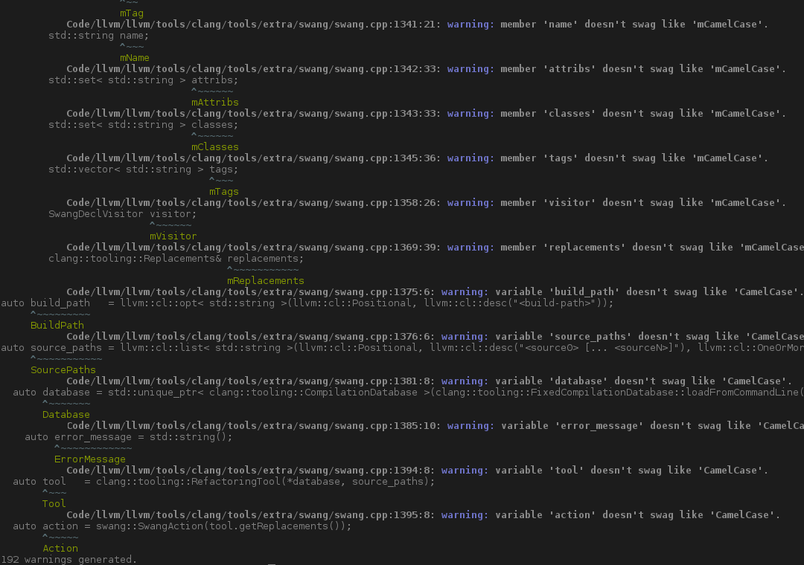

===============================================
Swang: Check how much swagg your C++'s got!
===============================================

.. image:: http://img.shields.io/github/release/berenm/swang.svg?style=flat-square
    :alt: Github Release
    :target: https://github.com/berenm/swang/releases

.. image:: http://img.shields.io/badge/license-LLVM-blue.svg?style=flat-square
    :alt: LLVM License
    :target: https://github.com/berenm/swang/blob/swang/LICENSE.TXT

.. image:: http://img.shields.io/badge/gitter-join%20chat%20%E2%86%92-brightgreen.svg?style=flat-square
    :alt: Gitter Chat
    :target: https://gitter.im/berenm/swang



USAGE
````````````````````````````

1. Generate your compilation database in order to inform LLVM's libTooling of the various flags and
   include paths it has to use to parse your code. CMake can do that when called with
   ``-DCMAKE_EXPORT_COMPILE_COMMANDS=1``

2. Create a ``.swang`` file containing the style you want to use. Each parsed file, header or source,
   will trigger a recursive search, looking for a ``.swang`` file in any of its parent directories. The
   search will use the first file found if any.

   *This allows different files to have different styles applied, even when including system headers or
   third-party libraries.*

3. Call ``swang`` with the folder containing the compilation database as first argument and the
   names of all the files you want to check after it.


CONFIGURATION
````````````````````````````

The .swang configuration files are in YAML format. Each element will describe the style to check for
a particular kind of C++ identifier.

Each style can define any of the following properties.

- ``prefix``: prefix to add to all identifiers of this kind
- ``suffix``: suffix to add to all identifiers of this kind
- ``casing``:

  - ``aNy_CasE`` / ``any``: any case is valid (default)
  - ``lower_case`` / ``lower``: lower case alpha numeric characters, words separated with underscores
  - ``UPPER_CASE`` / ``upper``: upper case alpha numeric characters, words separated with underscores
  - ``CamelCase`` / ``camel``: alpha numeric characters, words starting with upper case letter
  - ``camelBack`` / ``camel_back``: alpha numeric characters, words starting with upper case letter except first

The available elements are the following. Many styles fallback to a more general styles if not
defined.

- ``namespace``: any namespace
- ``inline_namespace``: inline namespaces

- ``constexpr_variable``: a constexpr variable
- ``enum_constant``: an enum constant
- ``global_constant``: a global constant
- ``global_variable``: a global variable
- ``local_constant``: a local constant
- ``local_variable``: a local variable
- ``static_constant``: a static constant (function)
- ``static_variable``: a static variable (function)
- ``class_constant``: a static constant (class)
- ``class_member``: a static variable (class)
- ``member_constant``: a constant member
- ``member``: a member
- ``constant``: a constant
- ``variable``: a variable

- ``parameter_constant``: a const parameter
- ``parameter_pack``: a parameter pack
- ``parameter``: a parameter

- ``abstract``: an abstract class
- ``pod``: a POD class
- ``struct``: a struct
- ``class``: a class
- ``union``: an union
- ``enum``: an enum

- ``function``: a function
- ``class_method``: a class (static) method
- ``method``: a method

- ``typedef``: a ``typedef ... type``
- ``template_using``: a ``template<...> using type = ...``
- ``using``: a ``using type = ...``

- ``type_template_parameter``: a type template parameter
- ``value_template_parameter``: a non-type template parameter
- ``template_template_parameter``: a template template parameter
- ``template_parameter``: a template parameter

See example ``.swang`` file to get an idea.

COPYING INFORMATION
````````````````````````````

 Distributed under the LLVM Software License.

 See accompanying file LICENSE.txt
